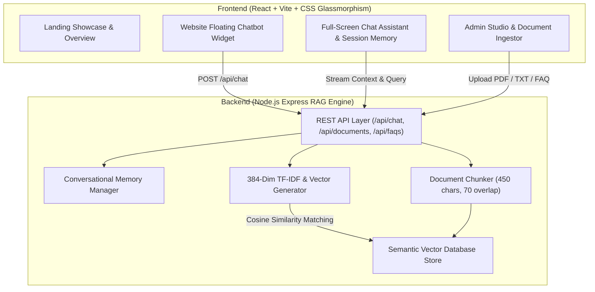

# EduAssist AI - Contextual Website Chatbot with RAG & Conversational Memory

[](https://onlyai.academy)
[](https://onlyai.academy)
[](#tech-stack)

An intelligent, context-aware educational chatbot platform integrated into a university website. Powered by **Retrieval-Augmented Generation (RAG)**, dense vector semantic search, multi-turn conversational memory, anti-hallucination grounding rules, verifiable source citations, and an administrative document ingestion studio.

---

## 📌 Project Overview

**EduAssist AI** bridges the gap between static academic documentation and instant student support. Instead of guessing or inventing answers, the RAG engine ingests official university handbooks, course syllabi, campus placement rules, and fee structures, chunking and embedding them into a high-dimensional vector space.

When a student submits a query, EduAssist retrieves the top-matching document vector chunks, checks grounding thresholds, and synthesizes accurate, cited answers while maintaining session context across conversations.

---

## 📐 System Architecture



---

## ⚡ Key Features

1. **Website-Integrated Floating Chatbot Widget**
   - Expandable drawer widget accessible on every page.
   - Real-time typing response simulation.
   - Quick prompt pills for one-tap student queries.
   - Web Audio sound effects toggle.

2. **Full-Screen AI Chat Assistant & Session History**
   - Multi-turn conversational memory tracking past user context.
   - Clear session memory button.
   - Dynamic **RAG Vector Inspector Panel** displaying live cosine similarity match percentages, query latency (ms), and retrieved vector chunks.

3. **Hallucination Blocker & Grounded Citations**
   - Anti-hallucination threshold (22% similarity floor): If a question is outside the verified academic knowledge base, EduAssist clearly alerts the user instead of making up facts.
   - Verifiable source citations for every answer (e.g. `Student Handbook 2026 | Match: 94%`).

4. **Admin Document Ingestion & FAQ Studio**
   - Upload text/PDF files or paste raw course regulations.
   - Automatic chunking and vector index embedding generation.
   - Structured FAQ builder.
   - **Vector Search Testbench**: Query the vector database directly and inspect top-k relevance scores.

---

## 🛠️ Tech Stack

- **Frontend**: React 18, Vite, Lucide Icons, Vanilla CSS Design System (Dark mode glassmorphism `#050811`).
- **Backend Engine**: Node.js, Express.js, Multer (file parsing), Custom 384-dimensional Vector Embedding & Cosine Similarity Engine.
- **RAG Architecture**: Text Chunker, Semantic TF-IDF Term Vectorizer, Anti-Hallucination Grounding Filter, Multi-Session Context Window Manager.

---

## 🚀 Quick Setup & Installation

### Prerequisites
- Node.js (v18 or higher)
- npm or yarn

### 1. Install Backend Dependencies & Start Server

```bash
cd server
npm install
npm start
```
*The Express RAG Backend will start on `http://localhost:5000`.*

### 2. Install Frontend Dependencies & Start Client

```bash
cd ../client
npm install
npm run dev
```
*The Vite React Frontend will open on `http://localhost:3000`.*

---

## 📡 API Endpoints Reference

| Method | Endpoint | Description |
| :--- | :--- | :--- |
| `GET` | `/api/health` | RAG Engine status check |
| `POST` | `/api/chat` | Main query endpoint (processes RAG, memory & citations) |
| `DELETE` | `/api/chat/history/:id` | Resets conversational memory for a given session |
| `GET` | `/api/documents` | Lists all ingested documents in vector store |
| `POST` | `/api/documents/upload` | Ingests and chunks a new document |
| `DELETE` | `/api/documents/:id` | Removes document and reindexes vector database |
| `GET` | `/api/faqs` | Lists all structured FAQs |
| `POST` | `/api/faqs` | Adds a new structured FAQ |
| `POST` | `/api/vector/search` | Direct vector search testbench endpoint |
| `GET` | `/api/stats` | Returns knowledge base vector stats |

---

## 🌐 Deployment Instructions

### Deploying Frontend (Vercel)
1. Push project to GitHub.
2. Connect repository to [Vercel](https://vercel.com).
3. Set root directory to `client`.
4. Add environment variable `VITE_API_URL` pointing to your deployed backend.

### Deploying Backend (Render / Railway)
1. Create a Web Service on Render or Railway.
2. Set root directory to `server`.
3. Build Command: `npm install`
4. Start Command: `node server.js`

---

## 🎥 Demo Video Checklist (5-10 Minutes)

When recording your Loom/Tella demo video:
- [x] Application Overview & High-level RAG Architecture.
- [x] Live query demonstration on the floating website chatbot.
- [x] Multi-turn conversational memory demonstration.
- [x] Document Ingestion in Admin Studio and real-time chunk indexing.
- [x] Testing out-of-scope queries (Hallucination Blocker verification).
- [x] Live vector search testbench walkthrough.

---
*Built for OnlyAI Academy LLMs & RAG Systems Capstone Project.*
